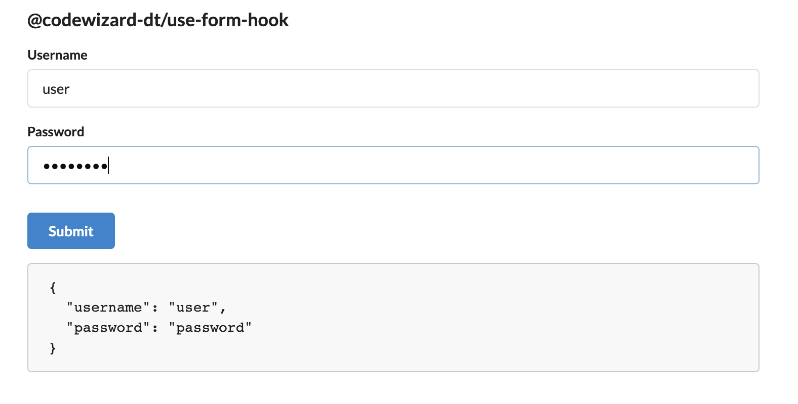

<!-- @format -->

# Dynamic React Forms

[](https://opensource.org/licenses/MIT)

## A `Form` component exposed by a hook

Hooking up forms in React can be a real pain in the butt, but this package makes it EASY. It automatically handles form data in a way that prevents unnecessary component re-renders and helps you write the LEAST CODE possible. This package also relies on Semantic UI.

# Table of Contents

- [Installation](#installation)
- [Usage](#usage)
- [License](#license)
- [Contributing](#contributing)
- [Tests](#tests)
- [Questions](#questions)

# Installation

- Run `npm i @codewizard-dt/use-form-hook
- Install peer dependencies
  - `semantic-ui-css`
  - `semantic-ui-react`
  - `lodash`
  - `path`
  - `react` of course

# Usage

## Import Semantic UI Global Css

With NextJs, add this line in `_app.(tsx|jsx)`, otherwise any top-level component.

```ts
import "semantic-ui-css/semantic.min.css";
```

## Put `FormProvider` in your app layout

```tsx
import { FormProvider } from "@codewizard-dt/use-form-hook";
<FormProvider>
  ...
  {children} // Any child of `FormProvider` can use the hook */
  ...
</FormProvider>
```

## Call `useForm` hook to expose the `Form` component

```tsx
import { useForm } from "@codewizard-dt/use-form-hook";
const ChildComponent = (props) => {
  const { Form } = useForm();
  return <Form fields={[]} submit={submitHandler} respond={responseHandler} />;
};
```

## Provide the `Form` element with `fields`, `submit`, and `respond` properties

### Provide `fields` property as an array of objects

```tsx
// Example.. Notice all you need is a `name`
fields={[
  { name: "username" }, 
  { name: "password", type: "password" },
  { name: "address", fields: [
    {name: "street", width: "6"},
    {name: "city", width: "3"},
    {name: "state", width: "3"}
  ]}
]}
```

## Fields
| Property | Description | Required |
| ----------- | ----------- | ----------- |
| name | (string) used as a string key for form data | true |
| initial | (string) initial field value | false |
| type | (string) describes data type, ie 'text', 'number', 'password' | false |
| label | (string) a label to display alongside | false |
| useLabel | (boolean) if true and label not given, name is used | false |
| required | (boolean) shows indicator and affects form behavior as normal | false |
| control | (any) HTML tag (ie 'input', 'select') or a Semantic UI form control component | false |
| options | Array(string\|object) rendered as `<option>` for `<select>` tags | false |
| disabled | (boolean) | false |
| width | (SemanticWIDTHS) width as determined by Semantic UI | false |
| fields | (Field) creates nested form groups | false |
| widths | (SemanticWIDTHS) determines width for nested form fields | false |

## The Form Data Object

Automatically constructed data object for all fields in the form. If the form fields are nested, the data is nested too.

```tsx
// Example, no nested fields
fields = {[
  { name: "username" }, 
  { name: "password", type: "password" },
]}

...

data = {
  username: '',
  password: ''
}
```


```tsx
// Example, nested fields
fields = {[
  { 
    name: "city",
    widths: "two",
    fields: [
      { name: 'best_restaurant' },
      { name: 'worst_restaurant' }
    ] 
  }
]}

...

data = {
  city: {
    best_restaurant: '',
    worst_restaurant: ''
  }
}
```
 

```tsx
// Example, nested fields but the group has no name
// When group has no name, data is flattened
// You might want to do this for styling but don't want the data nested
fields = {[
  { 
    name: "",
    fields: [
      { name: 'best_restaurant' },
      { name: 'worst_restaurant' }
    ] 
  }
]}

...

data = {
  best_restaurant: '',
  worst_restaurant: ''
}
```
 
 

### Provide `submit` property as a function

```ts
/**
 * Defines the `submit` property which sends the form data to the Api 
 * Must return a promise
 */

export type FormSubmitHandler = (data: ApiFormData) => Promise<ApiResponse<any>>

const submit:FormSubmitHanlder = (data) =>{
  return post('url',data)
}
```

### Provide `respond` property as a function

```ts
/**
 * Defines the `respond` property which receives the ApiResponse
 * Where <T> is the data type you expect from the API
 */
export type ApiResponse<T> = {
  data?: T,
  error?: any,
  errors?: {
    [key: string]: string
  }
}
export type ApiResponseHandler<T> = (response: ApiResponse<T>) => void

const respond:ApiResponseHandler<YourDataType> = (response) =>{
  // data = your API data
  // error = generic error or specific form error, either way automatically displayed under the form
  // errors = specific form errors, validation for instance. Displayed under any Field whose name matches one of the objects' keys
  let { data, error, errors } = response
}
```


# License

This project is provisioned under the [MIT License](https://opensource.org/licenses/MIT)

# Contributing

[Repo link](https://github.com/codewizard-dt/use-form-hook)

Do you want to help make this project better? Visit the the repo to check out existing issues or create a new branch to start working on a suggested feature

# Tests

None yet!

# Questions

If you have any questions, please contact me on [Github](https://github.com/codewizard-dt) or [email](mailto:david@codewizard.app).
